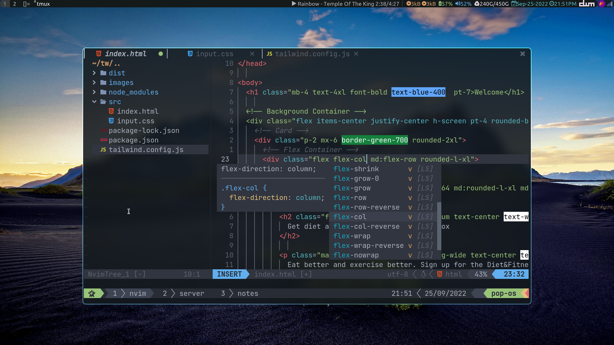

# Requirement

- sudo pacman -S [nodejs](https://nodejs.org/) npm neovim zenity ripgrep the_silver_searcher
- sudo apt-get install zenity ripgrep silversearcher-ag
- npm install -g live-server js-beautify prettier yarn
- npm install -g bash-language-server (optoinal, but recommended)
- pip install python-language-server
- pip install pynvim --upgrade
- make sure python is on $PATH (not python3) I did sudo cp python3 python in /usr/bin
- [neovim](https://github.com/neovim/neovim.git) >= 0.7.0 (or download the binary and put in your $PATH)
- [nodejs](https://nodejs.org/) >= 14.14 (>= 17.xx is better) or download the binary, cp to /usr/local/, add to path; ex: `export PATH=/usr/local/node-v18.10.0-linux-x64/bin:$PATH`
- [Coc extension](https://github.com/neoclide/coc.nvim/wiki/Using-coc-extensions) to read. (already installed in vimplug/plugins.vim)

# VimPlug

Install [VimPlug](https://github.com/junegunn/vim-plug). <br />

for NeoVim (Linux)

```sh
sh -c 'curl -fLo "${XDG_DATA_HOME:-$HOME/.local/share}"/nvim/site/autoload/plug.vim --create-dirs \
       https://raw.githubusercontent.com/junegunn/vim-plug/master/plug.vim'
```

for NeoVim (PowerShell)

```sh
iwr -useb https://raw.githubusercontent.com/junegunn/vim-plug/master/plug.vim |`
    ni "$(@($env:XDG_DATA_HOME, $env:LOCALAPPDATA)[$null -eq $env:XDG_DATA_HOME])/nvim-data/site/autoload/plug.vim" -Force
```

### Note for PowerShell in Windows

Change the 'source*' line in init.vim file from `source ~/.config/nvim/*.vim`to`source ~/AppData/Local/nvim/config/\*.vim`.

# Keybindings

## My keybindings:

Map leader = Space

| Key          | Descriptions                              |
| ------------ | ----------------------------------------- |
| leader-n     | Toggle NVIM Tree                          |
| leader-m     | Find file NVIM Tree                       |
| leader-f     | Telescope find_files                      |
| leader-g     | Telescope live_grep                       |
| leader-o     | Telescope buffers                         |
| leader-y     | Copy full path in current buffer          |
| leader-p     | Prettier                                  |
| leader-h     | nohl                                      |
| leader-l     | hlsearch                                  |
| leader-w     | Write (save)                              |
| leader-q     | Quit                                      |
| leader-sp    | Git signs preview hunk toggle             |
| leader-sj    | Git signs next hunk                       |
| leader-sk    | Git signs prev hunk                       |
| leader-sv    | split                                     |
| leader-vs    | vsplit                                    |
| leader-tr    | Type and replace (global) 'old/new'       |
| leader-tl    | Type and replace (current line) 'old/new' |
| leader-rl    | Remove some last chacacter                |
| leader-rw    | Remove whitespaces                        |
| leader-sq    | Put sequance number                       |
| leader-ez    | Like changing file type extension         |
| leader-eq    | Like changing file type extension         |
| shift-h      | Previous buffers                          |
| shift-l      | Next buffers                              |
| space-c      | Close current buffers                     |
| Ctr-hjkl     | Move focuse split                         |
| Ctr-t        | Toggle Terminal                           |
| Ctr-/        | Toggle Comment                            |
| Ctr-<arrow>  | Resize split                              |
| Alt-j,k      | Page down, page up                        |
| Alt-j,k (v)  | Move line up and down (in visual mode)    |
| JK           | Move line up and down (in visual mode)    |
| -,=          | increase, decrease number                 |
| F3, F4       | set number, set relativenumber (toggle)   |
| F5           | Toggle undotree                           |
| F10          | Write (save)                              |
| F11          | Toggle wraping text                       |
| jk or kj (i) | Escape from insert mode (in insert mode)  |
| ---------    | --------------------                      |

## Color Picker (VCoolor) keybindings:

- `<Alt-H>` you can insert a hrx color anywhere (NORMAL and INSERT modes).
- `<Alt-R>` you can insert a rgb color anywhere (NORMAL and INSERT modes).
- `<Alt-V>` you can insert a hsl color anywhere (NORMAL and INSERT modes).
- `<Alt-W>` you can insert a rgba color anywhere (NORMAL and INSERT modes).

## Multiple Cursor keybindings

### normal mode / visual mode

- start: `<C-n>` start multicursor and add a _virtual cursor + selection_ on the match
  - next: `<C-n>` add a new _virtual cursor + selection_ on the next match
  - skip: `<C-x>` skip the next match
  - prev: `<C-p>` remove current _virtual cursor + selection_ and go back on previous match
- select all: `<A-n>` start multicursor and directly select all matches

You can now change the _virtual cursors + selection_ with **visual mode** commands.
For instance: `c`, `s`, `I`, `A` work without any issues.
You could also go to **normal mode** by pressing `v` and use normal commands there.

At any time, you can press `<Esc>` to exit back to regular Vim.

**NOTE**: start with `g<C-n>` to match without boundaries (behaves like `g*` instead of `*`)

### visual mode when multiple lines are selected

- start: `<C-n>` add _virtual cursors_ on each line

You can now change the _virtual cursors_ with **normal mode** commands.
For instance: `ciw`.

### command

The command `MultipleCursorsFind` accepts a range and a pattern (regexp), it creates a _visual cursor_ at the end of each match.
If no range is passed in, then it defaults to the entire buffer.
